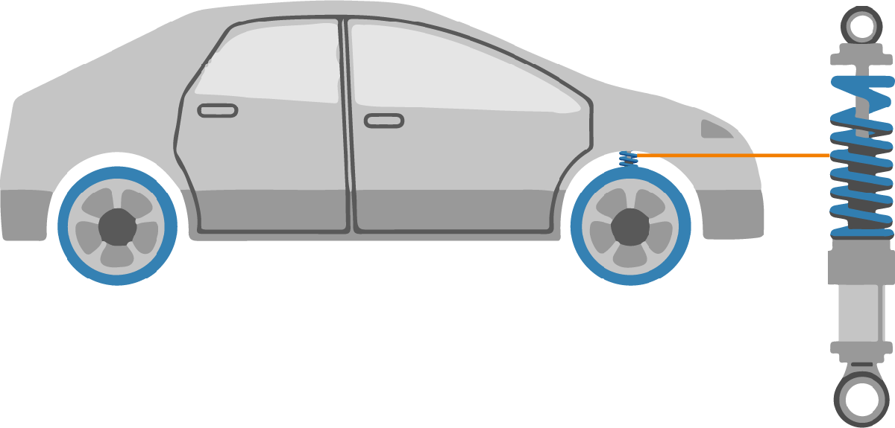
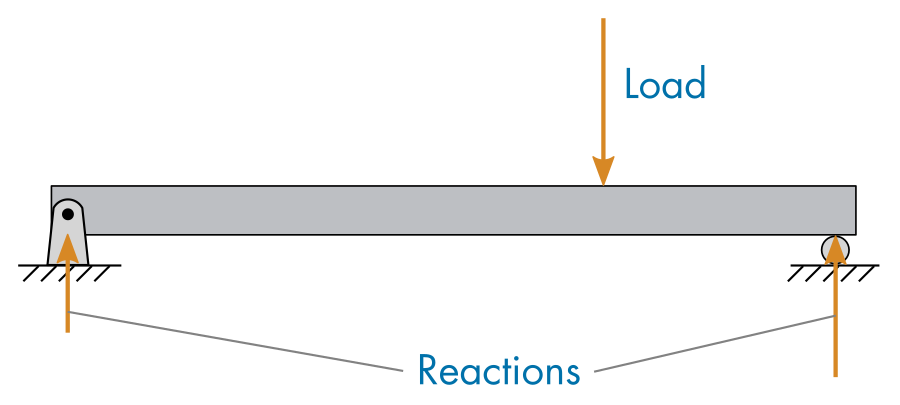

# Mass\-Spring\-Damper Systems

 or 

**Curriculum Module**

_Created with R2020b. Compatible with R2024a and later releases._

# Information

This curriculum module contains interactive [MATLAB® live scripts](https://www.mathworks.com/products/matlab/live-editor.html) and [Simulink® models](https://www.mathworks.com/products/simulink.html)  that explore mass\-spring\-damper systems. Students learn to create and work with mass\-spring\-damper models in guided activities.

## Background

These techniques are motivated by two applications: tuning the damping of a vehicle’s suspension and analyzing a building’s response to an earthquake. Throughout the module, students apply Simulink models to study the dynamics of the physical systems. In the final lesson, students identify the resonant frequencies of a mass\-spring\-damper building model by computing the power spectrum of a displacement signal.

The instructions inside the live scripts will guide you through the exercises and activities. Get started with each live script by running it one section at a time. To stop running the script or a section midway (for example, when an animation is in progress), use the  Stop button in the **RUN** section of the **Live Editor** tab in the MATLAB Toolstrip.

## Contact Us

Contact the [MathWorks teaching resources team](mailto:onlineteaching@mathworks.com) if you would like to provide feedback, or if you have a question.

## Prerequisites

This module assumes knowledge of free\-body diagram and mechanics. Those interested in additional training should consider completing [MATLAB Onramp](https://matlabacademy.mathworks.com/details/matlab-onramp/gettingstarted) & [Simulink Onramp](https://matlabacademy.mathworks.com/details/simulink-onramp/simulink) as a further learning exploration.

## Getting Started
### Accessing the Module
### **On MATLAB Online:**

Use the  link to download the module. You will be prompted to log in or create a MathWorks account. The project will be loaded, and you will see an app with several navigation options to get you started.

### **On Desktop:**

Download or clone this repository. Open MATLAB, navigate to the folder containing these scripts and double\-click on [mass\-spring\-damper\-systems.prj](https://matlab.mathworks.com/open/github/v1?repo=MathWorks-Teaching-Resources/Mass-Spring-Damper-Systems&project=mass-spring-damper-systems.prj&file=README.mlx). It will add the appropriate files to your MATLAB path and open an app that asks you where you would like to start. 

Ensure you have all the required products (listed below) installed. If you need to include a product, add it using the Add\-On Explorer. To install an add\-on, go to the **Home** tab and select   **Add-Ons** > **Get Add-Ons**. 

## Products

MATLAB®, Simulink®, Symbolic Math Toolbox™.

# Scripts
## [**MassSpringDamper.mlx**](https://matlab.mathworks.com/open/github/v1?repo=MathWorks-Teaching-Resources/Mass-Spring-Damper-Systems&project=mass-spring-damper-systems.prj&file=Scripts/MassSpringDamper.mlx)
|      |      |
| :-- | :-- |
|     | **In this script, students will...**   $\bullet$ model a single mass\-spring\-damper.   $\bullet$ Turn the damping of a vehicle suspension system.   $\bullet$ Relate the mass, spring, and damper to their corresponding components in a physical system     |
|      |       |

## [**DoubleMassSpringDamper.mlx**](https://matlab.mathworks.com/open/github/v1?repo=MathWorks-Teaching-Resources/Mass-Spring-Damper-Systems&project=mass-spring-damper-systems.prj&file=Scripts/DoubleMassSpringDamper.mlx)
|      |      |
| :-- | :-- |
|     | **In this script, students will...**   $\bullet$ model a double mass\-spring\-damper in Simulink   $\bullet$ Identify the resonant frequencies present in a two\-story building,   $\bullet$ Use the Symbolic Math Toolbox to help create Simulink models     |
|      |       |

## [**MultipleMassSpringDamper.mlx**](https://matlab.mathworks.com/open/github/v1?repo=MathWorks-Teaching-Resources/Mass-Spring-Damper-Systems&project=mass-spring-damper-systems.prj&file=Scripts/MultipleMassSpringDamper.mlx)
|      |      |
| :-- | :-- |
|     | **In this script, students will...**   $\bullet$ Vectorize a Simulink model for multiple building analysis.   $\bullet$ Use the spectrum analyzer block to compute the power spectrum.   $\bullet$ Complete Simulink mass\-spring\-damper models with n degrees of freedom     |
|      |       |

# Related Courseware Modules

## [Beam Bending and Deflection](https://www.mathworks.com/matlabcentral/fileexchange/113670-beam-bending-and-deflection?s_tid=ta_fx_results)
|      |      |
| :-- | :-- |
|     | **Available on:**           [GitHub](https://github.com/MathWorks-Teaching-Resources/Beam-Bending-and-Deflection)      |
|      |       |

Or feel free to explore our other [modular courseware content](https://www.mathworks.com/matlabcentral/fileexchange/?q=tag%3A%22courseware+module%22&sort=downloads_desc_30d).

# Educator Resources
-  [Educator Page](https://www.mathworks.com/academia/educators.html) 

# Contribute 

Looking for more? Find an issue? Have a suggestion? Please contact the [MathWorks teaching resources team](mailto:%20onlineteaching@mathworks.com). If you want to contribute directly to this project, you can find information about how to do so in the [CONTRIBUTING.md](https://github.com/MathWorks-Teaching-Resources/Mass-Spring-Damper-Systems/blob/release/CONTRIBUTING.md) page on GitHub.

 *©* Copyright 2023 The MathWorks™, Inc

